<h1>Jung Do Hyun(정도현)</h1>

Software Development Engineer at Amazon Web Services

Location: Seoul, Korea
Email: [serithemage@gmail.com](mailto://serithemage@gmail.com)
Blog: [moreagile.net](https://moreagile.net)   
Linkedin: [@serithemage](https://www.linkedin.com/in/jung-dohyun-b66b8262/)

# Summary
I have extensive experience as a Software Developer, Architect, IT Consultant, Tech Blogger, and Technical Trainer since 1995. I excel in software development tasks when provided with adequate resources, including time. My interests include soft skills, hard skills, team building, process optimization, programming languages, frameworks, and tooling related to software development optimization.
I also like to talk about better software development with a wide range of people.

# Tech Stack 
## Programming Language
- JavaScript ES6 & TypeScript 5
- Python3
- Java17
## Cloud
- AWS
  - Serverless architecture
    - Lambda, StepFunction, API G/W, AppSync
  - DevOps
    - CodeCommit, CodeGuru, CodeBuild, CodeDeploy
  - MLOps
    - Sagemaker, Glue

## DB
- DynamoDB  
- MySQL(RDS, Aurora)
- Redshift
- Neptune (Graph DB)
  - Neo4J
## Data & Analytics
- Pandas
- Scikit-Learn
## Frontend
- React
- Svelte
## Etc
- Git
- Docker
- ECS
- Kubernetes
- GraphQL

# Experience 

## Amazon Web Service - Seoul, Korea (2016.07 ~ Present)
### Software Development Engineer (2022.07 ~ Present)
- As a Senior Developer in AWS T&C Services Development, responsible for the development and operation of skillbuilder.aws, a service for AWS learning.
  - Designed and implemented a serverless architecture using DDD principles.
  - Improved front-end latency by 500% based on customer feedback.
- Developed an A/B testing service using TypeScript and AWS CDK, creating a fully automated CI/CD pipeline.

### Technical Trainer (2016.07 ~ 2022.06)
- Delivered training on a variety of AWS subjects including AWS Cloud Practitioner Essentials, AWS Technical Essentials, Architecting on AWS, and more.
- Taught courses primarily related to Security, Development, ML Pipeline and DevOps.
  - [Architecting on AWS](https://aws.amazon.com/ko/training/classroom/architecting-on-aws/?ct=sec&sec=rolesol)
  - [Advanced Architecting on AWS](https://aws.amazon.com/ko/training/classroom/advanced-architecting-aws/?ct=sec&sec=rolesol)
  - [Security Engineering on AWS](https://aws.amazon.com/ko/training/classroom/security-engineering-on-aws/)
  - [Running Containers on Amazon Elastic Kubernetes Service (Amazon EKS)](https://aws.amazon.com/ko/training/classroom/running-containers-on-amazon-elastic-kubernetes-service-amazon-eks/?ct=sec&sec=rolesol)
  - [Big Data on AWS](https://aws.amazon.com/ko/training/classroom/big-data-on-aws/?ct=sec&sec=rolesol)
  - [Developing on AWS](https://aws.amazon.com/ko/training/classroom/developing-on-aws/?ct=sec&sec=rolesol)
  - [Advanced Developing on AWS](https://aws.amazon.com/ko/training/classroom/advanced-developing-on-aws/?ct=sec&sec=rolesol)
  - [DevOps Engineering on AWS](https://aws.amazon.com/ko/training/classroom/devops-engineering-on-aws/?ct=sec&sec=rolesol)
  - [Deep Learning on AWS](https://aws.amazon.com/ko/training/classroom/deep-learning-on-aws/?ct=sec&sec=rolesol)
  - [MLOps Engineering on AWS](https://aws.amazon.com/ko/training/classroom/mlops-engineering-on-aws/?ct=sec&sec=rolesol)
  - [Machine Learning Pipeline on AWS](https://aws.amazon.com/ko/training/classroom/the-machine-learning-pipeline-on-aws/?ct=sec&sec=rolesol)
  - [Developing Serverless Solutions on AWS](https://aws.amazon.com/ko/training/classroom/developing-serverless-solutions-on-aws/?ct=sec&sec=rolesol)

## Mamezou - Tokyo, Japan (2013.01 ~ 2016.05)
### Architect, IT Consultant 
- Improved development processes and managed cloud migration projects.
- Introduced Git-based CI/CD pipeline and code review processes.

## Global Cybernet System - Tokyo, Japan (2002.06 ~ 2012.12)
### Java Developer, Architect, General Manager
- Developed enterprise and embedded applications.
- Standardized development processes and managed projects.

## LemonSoft - Seoul, Korea (2000.02 ~ 2002.03)
### Web based game developer
- Web game developer and game producer

## Publications
- 배워서 바로 쓰는 14가지 AWS 구축패턴 (Amazon Web Services 定番業務システム14パターン 設計ガイド韓国語訳) - Hanbit Media, 2020
- 실전 AWS 워크북(Amazon WebServices 定番業務システム12パターン 設計ガイド 韓国語訳) - Hanbit Media, 2017
- 나는 프로그래머다 2탄 - Hanbit Media, 2016
- 나는 프로그래머다 - Hanbit Media, 2015

## Community
### InfoQ (2014.12 - 2016.4)
- QCon Tokyo 2015 executive committee member

### I am a Programmer 나는 프로그래머다 - Podcast about software development (2015.3 - 2017.9)
- Producer & Host
- Developer meetup NapuCon organize

### AWS Korea User Group (2016.9 - now)
- A member of a community leader group
- Hands-on meetup organizer

## Education
### Yonsei University (1994.3 - 2001.2)
- Bachelor of Science (BS), Mathematics(Major) and Computer Science(Minor)

## Certification 

## Github metrics

